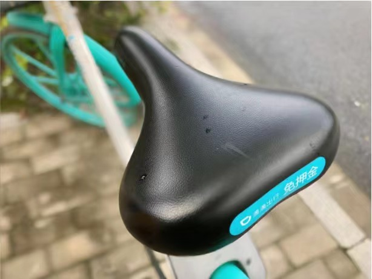
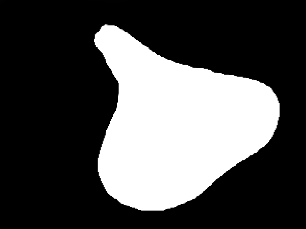
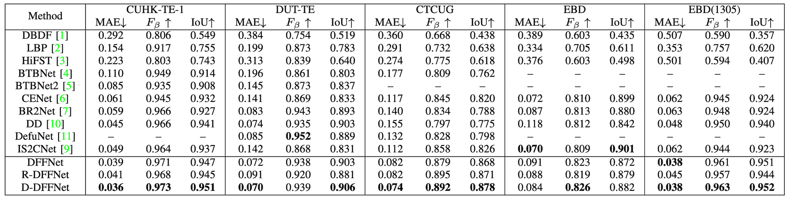
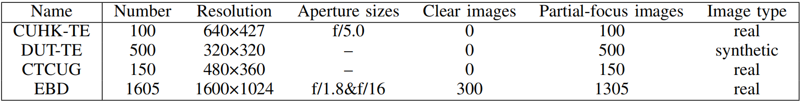

#  [Depth and DOF Cues Make A Better Defocus Blur Detector](https://arxiv.org/abs/2306.11334) 
### Yuxin Jin, [Ming Qian](https://qianmingduowan.github.io/), Jincheng Xiong, [Nan Xue](https://xuenan.net/), [Gui-Song Xia](http://www.captain-whu.com/xia_En.html)

Accepted by  IEEE International Conference on Multimedia and Expo (ICME) 2023


[](https://paperswithcode.com/sota/defocus-blur-detection-on-ctcug?p=depth-and-dof-cues-make-a-better-defocus-blur)
[](https://paperswithcode.com/sota/defocus-blur-detection-on-cuhk?p=depth-and-dof-cues-make-a-better-defocus-blur)

This is a PyTorch implementation of [D-DFFNet](https://arxiv.org/abs/2306.11334), which detects defocus blur region with depth prior and DOF cues.
Our D-DFFNet achieves SOTA on public benchmarks (e.g. DUT, CUHK, and CTCUG) with different splits.
Besides, we collect a new benchmark [EBD dataset](https://drive.google.com/file/d/1pkgfGSKx80Eq1_kq6-PwYl6zSYXwkqS8/view?usp=sharing) for analysis DBD model with more DOF settings.

<div>
    
</div>

## Quantitative Result

We compare our method with 14 recent methods, including DBDF, [LBP](https://github.com/xinario/defocus_segmentation), [HiFST](https://github.com/isalirezag/HiFST), [BTBNet](http://ice.dlut.edu.cn/ZhaoWenda/DBD.html) and its later version [BTBNet2](http://ice.dlut.edu.cn/ZhaoWenda/BTBCRLNet.html), [CENet](http://ice.dlut.edu.cn/ZhaoWenda/CENet.html), [BR2Net](https://github.com/ChangTang/BR2Net), [AENet](https://github.com/wdzhao123/DENets), [EFENet](https://github.com/wdzhao123/DENets), [DD](https://github.com/vinthony/depth-distillation), DefusionNet2(results: [CTCUG](https://pan.baidu.com/share/init?surl=QqMpyfzTF78u1xcdt6HFsw)(extraction code:kwpd),[DUT](https://pan.baidu.com/share/init?surl=VHRUaFR1ZduVXXpuLOLj9Q)(extraction code:ui5e)), [IS2CNet](https://github.com/wdzhao123/IS2CNet), LOCAL, and MA-GANet. We retrained the BR2Net model and used data from the papers for LOCAL and MA- GANet, as they did not provide codes and results. For the other methods, we downloaded their results or pre-trained models and tested them using our test1.py and test1_iou.py as testing code.


## Dataset
We collect a new dataset EBD for testing. Please download from this link if you plan to use it. [EBD dataset](https://drive.google.com/file/d/1pkgfGSKx80Eq1_kq6-PwYl6zSYXwkqS8/view?usp=sharing) 
Comparisons with existing DBD test datasets are as follows. 



## Pretrained Models
* We provide pre-trained models of our DFFNet and D-DFFNet using three different training data.

 Traing Datasets | CUHK-TR-1  | CUHK-TR-1&DUT-TR | CUHK-TR-2&DUT-TR
 ---- | ----- | ------  |  ------
 DFFNet  |  [DFFNet](https://drive.google.com/file/d/10UhCeEEl7OYjwzHZZByPbe6WpxqnWtbR/view?usp=sharing)  | [DFFNet](https://drive.google.com/file/d/1GN-HZ_lSZg25iX8d0fEx0qFZKXjCEhwc/view?usp=sharing) | [DFFNet](https://drive.google.com/file/d/1qiSoClOHZ9jV6qcaTOr6-QSh0ySwCsaX/view?usp=sharing)
 D-DFFNet  | [D-DFFNet](https://drive.google.com/file/d/1BRWXt8xphFv6AQDZwan4umm9EX3X4E2x/view?usp=sharing) | [D-DFFNet](https://drive.google.com/file/d/1NmrA8amNLkI-QPIq_N0Ti36Su7ungMo1/view?usp=share_link)  |[D-DFFNet](https://drive.google.com/file/d/1hU81jbHG-55HmaSgb0_GXOKhRC-enL8Q/view?usp=sharing) 
 * Pre-trained model for depth model: [midas_v21-f6b98070.pt](https://drive.google.com/file/d/1puxWdaUYayZhjf9WGGCwhMfkapl71eeB/view?usp=sharing)


## Results
We provide results on four test datasets. Since we use three different training data for a fair comparison with previous works, we provide all results related to the three different training data.

Traing Datasets | CUHK-TR-1  | CUHK-TR-1&DUT-TR | CUHK-TR-2&DUT-TR
 ---- | ----- | ------  |  ------
 Results  |[Results](https://drive.google.com/file/d/1ncVmYz26pmu_yS_J0Jbe15yvxJDQU3cS/view?usp=sharing) |[Results](https://drive.google.com/file/d/1tLC7zkD2oFu7hsjHA0w615rKqX6bgtAg/view?usp=share_link)  |[Results](https://drive.google.com/file/d/1nfH4l-E2yZuxTd-qh3sRHtYcCZPJW_tR/view?usp=sharing)


## Code

### Dependences
* Pytorch 1.12.0
* OpenCV 4.4.0
* Numpy 1.21.2
* PIL
* glob
* imageio
* matplotlib

### Training
* Download related datasets and put them to /D-DFFNet/data/.
* Download the depth pre-trained model and put it to /D-DFFNet/depth_pretrained/.
* Training in stage 1:
`python train_single.py` The checkpoint is saved to /D-DFFNet/checkpoint/ as DFFNet.pth.
* Training in stage 2:
`python train_kd.py` The checkpoint is saved to /D-DFFNet/checkpoint/ as D-DFFNet.pth.


### Testing
* `bash test.sh`

## Acknowledgements
Codes for the depth model and depth pre-trained model are from [MiDaS](https://github.com/isl-org/MiDaS).  
Part of our code is based upon [EaNet](https://github.com/geovsion/EaNet) and [CPD](https://github.com/wuzhe71/CPD).

## Citation
If you find our code & paper useful, please cite us:
```
@inproceedings{jin2023depth,
  title={Depth and DOF Cues Make A Better Defocus Blur Detector},
  author={Jin, Yuxin and Qian, Ming and Xiong, Jincheng and Xue, Nan and Xia, Gui-song},
  booktitle={IEEE International Conference on Multimedia and Expo},
  year={2023},
}
```

## Contact
If you have any questions or suggestions, please contact (Yuxin Jin jinyuxin@whu.edu.cn).


